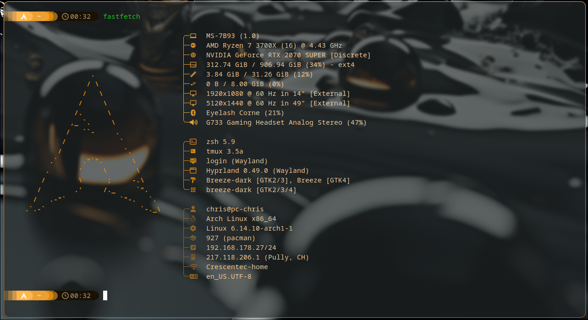

# Dot files configuration for my arch-hyprland

Using zsh, and symlink them to ~/.zshrc ~/.zshenv

## Screenshots

### waybar

### wlogout

### terminal

### wofi

### hyprlock

## Dependencies:

### Terminal
- Alacritty
- paru
- neovim
- tmux
- Nerd font: https://www.nerdfonts.com/font-downloads
- Starship (theme for terminal)
- nvm (node manager)
- eza (better ls)
- zoxide (better cd)
- zsh-syntax-highlighting
- zsh-autocomplete
- zsh-completions
- fastfetch
- topgrade (update)
  
### Menu bar
- waybar (menu bar)
- pipewire and pipewire-pulse (sound)
- pavucontrol (sound)
- gnome-disks (disk manager)
- wlogout (lockscreen)
- blueberry (bluetooth manager)
- wofi (search app)
- dunst (notification)
- btop (processes)
- nmtui (network manager)

### Hyprland
- hyperpaper (wallpaper)
- hyprlock (lockscreen)
- hyprcursor (cursor)
  -> Bibata-Amber
- hyprshot (screenshot)
- uwsm and libnewt (startup for hyprland)

### Others
- ncspot (spotify cli)
- cava (sound waves)
